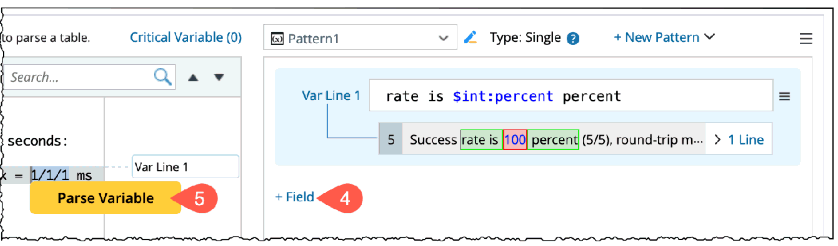
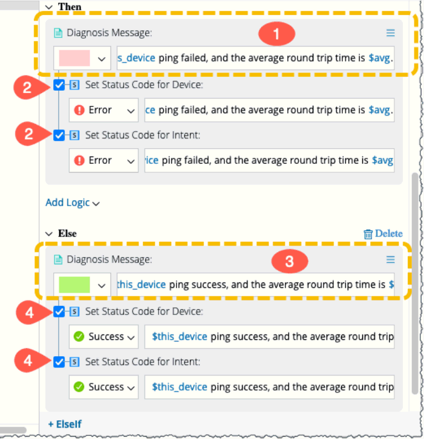

<table style="margin-bottom: 50px; height: 5px;" cellspacing="0" width="100%">
	<col style="width: 100%;" />
	<tr>
		<td style="vertical-align: middle;" bgcolor="#FFE5CE"><h1 style="margin-bottom: 50pt;">1 
		 Automate Frequently Used Commands </h1></td>
	</tr>
</table>

In this chapter, you will create your first intent. You will find that 
 it is easy to automate the 

frequently used CLI commands such as Ping &lt;destIP&gt; and show ip 
 route &lt;destIP&gt;. No 

programming knowledge is required. We will use two examples:

<table style="border-collapse: separate; border-collapse: separate;" cellspacing="0" 
		 width="82.334%" border="1">
	<col style="width: 43.214%;" />
	<col style="width: 56.786%;" />
	<tr>
		<td>
CLI Command
</td>
		<td>
Intent Description
</td>
	</tr>
	<tr>
		<td>
Ping &lt;destination ip&gt; 
		 
</td>
		<td>
Check whether the success rate 
		 is equal to 100% and the average round trip time is reasonable. 
		 If not, create an alert. 
</td>
	</tr>
	<tr>
		<td>
show ip route &lt;destination 
		 ip&gt;
</td>
		<td>
Compare the next hop to the 
		 last known value (baseline). If it changes, create an alert and 
		 set the baseline value. 
</td>
	</tr>
</table>

The key steps to define an intent are:

<ol style="list-style: decimal;">
	<li class="list">Select a device, enter the CLI command, and retrieve 
	 the data. </li>
	<li class="list">Define variables: from the CLI command results, find 
	 the data you are interested in and define it as the variable. </li>
	<li class="list">Define the Diagnosis: compare the variable with the 
	 normal status or design and create an alert. </li>
</ol>

This chapter also covers a common intent-based automation creation flow, 
 which has the following steps: 

<ol style="list-style: decimal;">
	<li class="list">Create a new map or open an existing map.</li>
	<li class="list">Under the Quick Intent tag, create an intent. You 
	 can edit and run the quick intent recursively till you are satisfied 
	 with the intent results. </li>
	<li class="list">Save the intent as a map intent.</li>
	<li class="list">Create the dashboard from the intent to better view 
	 the results. </li>
</ol>
<table style="margin-bottom: 12px; height: 20px;" cellspacing="0" width="100%">
	<col style="width: 100%;" />
	<tr>
		<td style="vertical-align: middle;" bgcolor="#FFE5CE"><h1 style="margin-bottom: 5pt;">1.1 
		 Search and Add Devices to the Map </h1></td>
	</tr>
</table>

The intent is always associated with a device or a set of devices, which 
 are called the seed device(s). You can draw these devices either by searching 
 devices from the search bar and adding them to the map or by drawing the 
 predefined group of devices to the map (recommended best practice). 

<h2>1.1.1 Draw Devices from a Device Group</h2>

You can create a device group and draw the predefined group of devices 
 to the map as follows: 

<ol style="list-style: decimal;">
	<li class="list">Go to Device Group from the start menu from the Lunar 
	 Net desktop. </li>
	<li class="list">&#160;In the device group pane, select the predefined 
	 group Cisco Routers and click the drop-down menu. </li>
	<li class="list">Click Draw Devices on Map to add the devices to a 
	 new map. </li>
	<li class="list">Close the Device group pane.</li>
	

</ol>
<h2>1.1.2 Draw Devices from the Search Bar</h2>

You can search and map devices from the Lunar Net desktop:

Search the device US-BOS-R1 in the search bar.

<ol style="list-style: decimal;">
	<li class="list">In the results device section, click Map to draw the 
	 device to the map. </li>
	<li class="list">Close the search results window and open the Intent 
	 pane. </li>
	<li class="list">Repeat the Step 1 thru Step 3 and add other cisco 
	 devices US-BOS-R2 and CA-TOR-R1. </li>
	

</ol>
<h2>1.1.3 Save the Device Map</h2>

In the Upper-Right corner of the screen, click the floppy disk icon 
 to save the current map. 

<ol style="list-style: decimal;">
	<li class="list">In the Save Map window, choose either a Desktop or 
	 another location to save the map. </li>
	<li class="list">Add a name [Ping Check (Cisco IOS) / Route Check (Cisco 
	 IOS)] to the map. </li>
	<li class="list">Click OK to save and close the window.</li>
	

</ol>
<table style="margin-bottom: 12px; height: 20px;" cellspacing="0" width="100%">
	<col style="width: 100%;" />
	<tr>
		<td style="vertical-align: middle;" bgcolor="#FFE5CE"><h1 style="margin-bottom: 5pt;">1.2 
		 Quick Intent Creation </h1></td>
	</tr>
</table>
<ol style="list-style: decimal;">
	<li class="list">From the map you just created,</li>
	<li class="list">Go to the Quick Intent tab in the Intent section.</li>
	<li>class=&quot;list&quot;&gt;Enter the command Ping 10.8.1.1 in Input 
	 or Select a command… field to collect data. For another example, you 
	 enter the command show ip route 0.0.0.0.</li>
	<li class="list">Click Retrieve to parse the data.</li>
	

	<li class="list">
The retrieved data sample will be:
</li>
	

	
&#160;

	

</ol>
<table style="margin-bottom: 12px; height: 20px;" cellspacing="0" width="100%">
	<col style="width: 100%;" />
	<tr>
		<td style="vertical-align: middle;" bgcolor="#FFE5CE"><h1>1.3 Define 
		 Variables with a Visual Parser</h1></td>
	</tr>
</table>

Defining variables is simple with Quick Intent using the auto-parser 
 feature. Entry-level users can quickly learn and utilize the parser. The 
 system will automatically select the appropriate parser mode (single or 
 multiple) based on input words. 

Once the auto-parser completes the parser definition task, you can add 
 additional variables or make adjustments to the line pattern to achieve 
 the desired result.

<h2>1.3.1 Define parser for ping &lt;destination ip&gt;</h2>

You can define a variable with the following steps:

<ol>
	<li>Create and add a parser using the option New located next to the 
	 Parser field.</li>
	

	<li>Select the text 100 in the sentence rate is 100 percent and click 
	 Parse Variable in the tip window. You can also double-click the text 
	 to get the same result.</li>
	

	<li>Click Apply.</li>
	

	<li>Click +Field to another variable for round trip time.</li>
	<li>Similar to Step 2, select the round-trip text value 1/1/2.</li>
	

	<li>Modify the Variable line pattern to min/avg/max = $int:min/$int:avg/$int:max 
	 ms.</li>
	
NOTE: The variable name is defined as &lt;type&gt;:&lt;variable_name&gt;. 
	 The default variable type isstring, and the type mstring is a string 
	 with spaces.

	<li>Click Apply.</li>
	

	<li>Select OK to save and close the window.</li>
	

	<li>Click Add to Intent, and the parsed variables are added to the 
	 diagnosis.</li>
	

</ol>
<h2>1.3.2 Define parser for Command Show ip route</h2>

You can define a variable with the following steps:

<ol>
	<li>Create and add a parser using the option New located next to the 
	 Parser field.</li>
	

	<li>Select the text Routing Entry For 0.0.0.0/0, and click Parse Variable 
	 in the tip window. You can also double-click the text to get the same 
	 result. </li>
	<li>Modify the Variable line pattern to Routing entry for $subnet,.</li>
	<li>Similar to Step 2, copy the next hop line 10.8.1.18 from the sample 
	 data and parse the variable.</li>
	

	<li>Modify the Variable line pattern to ^$mstring:nexthop, from.</li>
	
NOTE: The variable name is defined as $&amp;lt;type&amp;gt;:&amp;lt;variable_name&amp;gt;. 
	 The default variable type is string, and the type mstring is a string 
	 with spaces. The created variables will appear under the Parsed Result 
	 section.

	<li>Click Apply.</li>
	<li>Select OK to save and close the window.</li>
	

	<li>Click Add to Intent, and the parsed variables are added to the 
	 diagnosis.</li>
	

</ol>
<table style="margin-bottom: 12px; height: 20px;" cellspacing="0" width="100%">
	<col style="width: 100%;" />
	<tr>
		<td style="vertical-align: middle;" bgcolor="#FFE5CE"><h1>1.4 Define 
		 the Diagnosis</h1></td>
	</tr>
</table>

Go to the Define Logic section to define the diagnosis logic as follows:

<ol>
	<li>Enter the diagnosis name, e.g., Ping Cisco or Subnet next hop check.</li>
	<li>Define the condition as detailed in the following table and images:</li>
	<table style="border-collapse: separate; border-collapse: separate;" 
			 cellspacing="0" width="59.398%" border="1">
		<col style="width: 43.812%;" />
		<col style="width: 56.188%;" />
		<tr>
			<td>
Intent
</td>
			<td>
Steps
</td>
		</tr>
		<tr>
			<td>
Ping &lt;destination ip&gt;
</td>
			<td>
a. Variable percent does not equal 100.

			
b. Variable avg is Greater than 60.

			
c. Boolean Expression: A or B.
</td>
		</tr>
	</table>
	

	<table style="border-collapse: separate; border-collapse: separate;" 
			 cellspacing="0" width="51.045%" border="1">
		<col style="width: 37.766%;" />
		<col style="width: 62.234%;" />
		<tr>
			<td>
Intent
</td>
			<td>
Steps
</td>
		</tr>
		<tr>
			<td>show ip route &lt;destination ip&gt;</td>
			<td>
a. The variable subnet Is not empty.

			
b. Variable nexthop (Current) Does not equal nexthop (Baseline).

			
c. Boolean Expression: A and B.
</td>
		</tr>
	</table>
	

</ol>
<table style="margin-bottom: 12px;" cellspacing="0" width="100%">
	<col style="width: 100%;" />
	<tr style="height: 36px;">
		<td style="vertical-align: middle;" bgcolor="#FFE5CE"><h1>1.5 Define 
		 Intent Output</h1></td>
	</tr>
</table>

Enter a message under the Then and Else output areas to appear as the 
 result of the diagnosis.

<ol>
	<li>Then: Define a color, message and status in case If condition is 
	 true,as shown in the figure.</li>
	<li>Click the check box of the Set Status Code for Device and Set Status 
	 Code for Intent to duplicate the message to the Device Status Code.</li>
	<table style="border-collapse: separate; border-collapse: separate;" 
			 cellspacing="0" width="55.374%" border="1">
		<col style="width: 30.644%;" />
		<col style="width: 69.356%;" />
		<tr>
			<td>
Intent
</td>
			<td>
Message
</td>
		</tr>
		<tr>
			<td>
&#160;Ping
</td>
			<td>
$this_device ping failed, 
			 and the average round trip time is $avg ms
</td>
		</tr>
	</table>
	

	<table style="border-collapse: separate; border-collapse: separate;" 
			 cellspacing="0" width="75.716%" border="1">
		<col style="width: 37.256%;" />
		<col style="width: 62.744%;" />
		<tr>
			<td>
Intent
</td>
			<td>
Message
</td>
		</tr>
		<tr>
			<td>
Show IP route
</td>
			<td>
On $this_device subnet $subnet nexthop $nextHop is changed 
			 ($nextHop(Baseline)).
</td>
		</tr>
	</table>
	
NOTE:

	<ul>
		<li class="listcircle">By typing $, you can get the variable selection 
		 pop-up.</li>
		<li class="listcircle">For a variable, you can get the current 
		 value and baseline value.</li>
	</ul>
	

	<li>Else: Define a color, message and status in case If condition is 
	 not true, as shown in the figure. </li>
	<li>Click the checkbox of the Set Status Code for Device and Set Status 
	 Code for Intent to duplicate the message to the Device Status Code.</li>
	<table style="border-collapse: separate; border-collapse: separate;" 
			 cellspacing="0" width="79.599%" border="1">
		<col style="width: 40.555%;" />
		<col style="width: 59.445%;" />
		<tr style="height: 24px;">
			<td>
Intent
</td>
			<td>
Message
</td>
		</tr>
		<tr style="height: 28px;">
			<td>
Ping
</td>
			<td>
$this_device ping succeeded, and the average round trip 
			 time is $avg
</td>
		</tr>
		<tr style="height: 28px;">
			<td>
Show IP route
</td>
			<td>
On $this_device subnet $subnet nexthop $nextHop is not 
			 changed ($nextHop(Baseline)).
</td>
		</tr>
	</table>
	

	<li>Click on Create to save and create the intent.</li>
	

	<li>Go to the Run Intent pane and click Run to execute the diagnosis.</li>
	

	
Upon completing the diagnosis by the system, the following result 
	 will appear:

	<ul>
		<li class="listcircle">&#160;Intent execution date and time.</li>
		<li class="listcircle">&#160;Success/Failure message and status 
		 as defined in Then and Else conditions.</li>
		<li class="listcircle">&#160;The execution log can be accessed 
		 using the View Execution Log located under :</li>
	</ul>
	

</ol>
<table style="margin-bottom: 12px; height: 20px;" cellspacing="0" width="100%">
	<col style="width: 100%;" />
	<tr>
		<td style="vertical-align: middle;" bgcolor="#FFE5CE"><h1 style="margin-bottom: 5pt;">1.6 
		 Duplicate the Intent to Other Devices </h1></td>
	</tr>
</table>

An intent can be duplicated to other devices. The system will automatically 
 copy the parser and logic to other devices.

<ol>
	<li>You can duplicate the created intent to other devices as follows:</li>
	<li>Go to the Define Logic pane, and from the drop-down menu, select 
	 the option Duplicate to Other Devices.</li>
	<li>Select all the devices to which you want to copy the intent.</li>
	<li>Click OK to save.</li>
	

	<li>All the selected devices will be added to the list and click Recreate.</li>
	<li>In the Run Intent pane, all the devices will be listed with intent 
	 configured. </li>
	<li>Click Run to execute the intent diagnosis on all the devices. And 
	 the results are displayed.</li>
	

	<li>In the Run Intent pane, click Save to &gt;Save to Map Intent and 
	 then OK.</li>
	

</ol>
<table style="margin-bottom: 12px; height: 20px;" cellspacing="0" width="100%">
	<col style="width: 100%;" />
	<tr>
		<td style="vertical-align: middle;" bgcolor="#FFE5CE"><h1 style="margin-bottom: 5pt;">1.7 
		 Diagnosis Tree </h1></td>
	</tr>
</table>

Click to view the diagnosis tree. It includes the following details 
 as shown in the figure:

<ul>
	<li>Current NI medium,</li>
	<li>Execution date and time,</li>
	<li>The diagnosis tree in Pre-Execution and Post-Execution mode,</li>
	<li>The status of execution in each device with color legends.</li>
</ul>

<table style="margin-bottom: 12px; height: 20px;" cellspacing="0" width="100%">
	<col style="width: 100%;" />
	<tr>
		<td style="vertical-align: middle;" bgcolor="#FFE5CE"><h1 style="margin-bottom: 5pt;">1.8 
		 View the Result on Map </h1></td>
	</tr>
</table>

The result of the intent execution can be visualized in a map as shown 
 in the following map by selecting Show in Map button located in the Run 
 Intent pane:

<table style="margin-bottom: 12px; height: 20px;" cellspacing="0" width="100%">
	<col style="width: 100%;" />
	<tr>
		<td style="vertical-align: middle;" bgcolor="#FFE5CE"><h1 style="margin-bottom: 5pt;">1.9 
		 Create Intent and Summary Dashboard </h1></td>
	</tr>
</table>

You can view the intent results through two different dashboards:

<ul>
	<li>Intent Dashboard to view the individual Intent results and</li>
	<li>Summary Dashboard to view the consolidated Intent results in a 
	 single view.</li>
</ul>
<h2>1.9.1 Intent Dashboard</h2>

The Intent Dashboard observes specific network issues with details and 
 displays the results. You can save the frequently used dashboards as templates. 
 Intent Dashboard can be created directly from the Map Intent tab as follows:

<ol>
	<li>Go to the Map Intent tab and click on New Dashboard.</li>
	<li>In the Create Intent Dashboard window, define the following:</li>
	<ol>
		<li class="listalpha">Enter the Dashboard Name, Ping Latency Check</li>
		<li class="listalpha">Select the Location to save the Intent Dashboard.</li>
		<li class="listalpha">Data Source: By default, Specified Intent 
		 is selected from the dropdown.</li>
		<li class="listalpha">Intent: Keep the default intent to create 
		 the dashboard for the same intent. </li>
		<li class="listalpha">Click Create.</li>
	</ol>
	

	<li>
Create Intent Dashboard dialog pops up. Click Open Intent Dashboard, 
	 and the dashboard will be created.
</li>
	

</ol>
<h2>1.9.2 Summary Dashboard</h2>

The summary dashboard provides an overview displaying results from multiple 
 Intent dashboards of the entire network or a set of network devices. With 
 Summary Dashboard, you can group Intent Dashboards into widgets based 
 on diagnosis purpose and display results by device, site or device groups. 
 You can use the summary dashboard to monitor critical information across 
 thousands of devices and discover the root cause for issues in one view.

<ol>
	<li>Let us create a Summary Dashboard using the step-by-step instructions 
	 as follows:</li>
	<li>Click to open the menu located at the top-right corner of the dashboard 
	 window.</li>
	<li>Select Add to Summary Dashboard to open the corresponding window 
	 for creating a summary dashboard.</li>
	

	<li>In the Add to Summary Dashboard window, let us create the new summary 
	 dashboard and group as follows:</li>
	<ol>
		<li class="listalpha">Summary Dashboard: open the dropdown menu 
		 and select +New Summary Dashboard to pop up its dialogue.</li>
		<li class="listalpha">Enter the dashboard basic details like name, 
		 group title and location of the summary dashboard to save.</li>
		<li class="listalpha">Click OK to save and create the summary dashboard.</li>
		

	</ol>
	
You can add more intent dashboards to the same summary dashboard 
	 by choosing this summary dashboard located under My dashboards location 
	 Add to Summary Dashboard dropdown menu.

	<li>In the Add to Summary Dashboard dialog, a success message prompt 
	 appears along with the option to Open Summary Dashboard. Click to 
	 view the dashboard.</li>
	

	<li>Review the resulting Summary Dashboard and explore the dashboard 
	 interface.</li>
	

</ol>
<h2>1.9.3 Add an Intent Dashboard to an Existing Summary Dashboard</h2>

Now, let us add the route check intent dashboard to the Device Health 
 Monitor Summary

Dashboard created in Section 2.9.2 as follows:

<ol>
	<li>Go to the Map Intent tab and click New Dashboard to launch the 
	 Create Intent Dashboard window.</li>
	<li>Change the default dashboard name to Route check.</li>
	<li>Keep the default settings for Location (My Dashboards) and other 
	 fields</li>
	<li>Click Create.</li>
	

	<li>In the Create Intent Dashboard dialog, a success message prompt 
	 appears along with Click</li>
	<li>Add to Summary Dashboard to open its corresponding dialog.</li>
	

	<li>In the Add to Summary Dashboard window, click the Summary Dashboard 
	 dropdown menu to open and select the Device Health Monitor that you 
	 have created in Section 2.9.2 .</li>
	

	<li>Choose the dashboard group that you have created in the previous 
	 section or create a new group as per the need.</li>
	

	<li>Click OK to save and create the summary dashboard.</li>
	<li>Click Open Summary Dashboard to view the dashboard.</li>
	

	<li>Review the resulting Summary Dashboard and explore the dashboard 
	 interface.</li>
	

	
&#160;

</ol>
</body>
</html>

